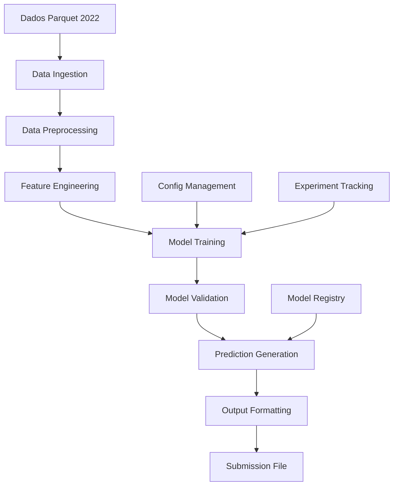

# Documento de Design - Modelo de Previsão de Vendas Hackathon 2025

## Visão Geral

O sistema será desenvolvido como um pipeline de machine learning end-to-end para previsão de vendas semanais. A arquitetura seguirá as melhores práticas de MLOps, com foco em reprodutibilidade, performance e facilidade de iteração para as 5 submissões permitidas.

## Arquitetura

### Arquitetura Geral do Sistema



### Stack Tecnológico

- **Linguagem**: Python 3.9+
- **Processamento de Dados**: Pandas, Polars (para performance), PyArrow
- **Machine Learning**: Scikit-learn, XGBoost, LightGBM, Prophet
- **Experiment Tracking**: MLflow ou Weights & Biases
- **Visualização**: Matplotlib, Seaborn, Plotly
- **Ambiente**: Jupyter Notebooks + Scripts Python modulares

## Componentes e Interfaces

### 1. Data Ingestion Module (`src/data/ingestion.py`)

**Responsabilidades:**
- Carregar arquivos Parquet de forma eficiente
- Validar integridade dos dados
- Consolidar múltiplos arquivos se necessário

**Interface:**
```python
class DataIngestion:
    def load_transactions(self, path: str) -> pd.DataFrame
    def load_products(self, path: str) -> pd.DataFrame  
    def load_stores(self, path: str) -> pd.DataFrame
    def validate_data_quality(self, df: pd.DataFrame) -> Dict[str, Any]
```

### 2. Data Preprocessing Module (`src/data/preprocessing.py`)

**Responsabilidades:**
- Limpeza e tratamento de dados faltantes
- Agregação temporal (diária → semanal)
- Integração de dados de diferentes fontes

**Interface:**
```python
class DataPreprocessor:
    def clean_transactions(self, df: pd.DataFrame) -> pd.DataFrame
    def aggregate_weekly_sales(self, df: pd.DataFrame) -> pd.DataFrame
    def merge_master_data(self, transactions: pd.DataFrame, 
                         products: pd.DataFrame, stores: pd.DataFrame) -> pd.DataFrame
```

### 3. Feature Engineering Module (`src/features/engineering.py`)

**Responsabilidades:**
- Criação de features temporais
- Features de lag e rolling statistics
- Encoding de variáveis categóricas
- Feature selection

**Estratégias de Features:**

#### Features Temporais
- Semana do ano, mês, trimestre
- Indicadores de sazonalidade (início/fim de mês, feriados)
- Tendência temporal

#### Features de Produto
- Categoria do produto
- Histórico de performance (média, mediana, volatilidade)
- Ranking de vendas por categoria

#### Features de PDV
- Tipo de loja (c-store, g-store, liquor)
- Localização (zipcode agrupado por região)
- Performance histórica do PDV

#### Features de Lag
- Vendas das últimas 1, 2, 4, 8 semanas
- Médias móveis (4, 8, 12 semanas)
- Crescimento percentual período anterior

### 4. Model Training Module (`src/models/training.py`)

**Abordagem Multi-Model:**

#### Modelo 1: XGBoost
- Excelente para capturar interações não-lineares
- Robusto a outliers
- Feature importance nativa

#### Modelo 2: LightGBM  
- Performance superior em datasets grandes
- Menor uso de memória
- Otimização automática de hiperparâmetros

#### Modelo 3: Prophet (Facebook)
- Especializado em séries temporais
- Captura sazonalidade automaticamente
- Robusto a dados faltantes

#### Modelo 4: Ensemble
- Combinação ponderada dos modelos acima
- Stacking com meta-learner
- Redução de overfitting

**Estratégia de Validação:**
- Time Series Split (respeitando ordem temporal)
- Walk-forward validation
- Validação por PDV/SKU para evitar data leakage

### 5. Prediction Module (`src/models/prediction.py`)

**Responsabilidades:**
- Geração de previsões para janeiro/2023
- Pós-processamento (garantir valores positivos)
- Formatação de saída

## Modelos de Dados

### Schema Principal

```python
# Transações Processadas
TransactionSchema = {
    'data': 'datetime64[ns]',
    'semana': 'int32',
    'pdv': 'int32', 
    'produto': 'int32',
    'quantidade': 'int32',
    'faturamento': 'float64',
    'categoria_produto': 'category',
    'tipo_pdv': 'category',
    'regiao': 'category'
}

# Features Finais
FeatureSchema = {
    'pdv': 'int32',
    'produto': 'int32', 
    'semana': 'int32',
    'quantidade_target': 'int32',  # target variable
    'lag_1_semana': 'float64',
    'lag_2_semanas': 'float64',
    'media_movel_4sem': 'float64',
    'tendencia': 'float64',
    'sazonalidade': 'float64',
    # ... outras features
}
```

## Tratamento de Erros

### Estratégias de Robustez

1. **Dados Faltantes:**
   - Imputação por média/mediana para features numéricas
   - Categoria "unknown" para categóricas
   - Forward fill para séries temporais

2. **Outliers:**
   - Detecção via IQR e Z-score
   - Winsorização (cap em percentis 1% e 99%)
   - Tratamento específico por categoria de produto

3. **Combinações PDV/SKU Novas:**
   - Fallback para média da categoria
   - Modelo específico para cold-start
   - Interpolação baseada em PDVs similares

4. **Validação de Previsões:**
   - Garantir valores não-negativos
   - Limites máximos baseados em capacidade histórica
   - Consistência temporal (evitar picos irreais)

## Estratégia de Testes

### Testes de Unidade
- Validação de transformações de dados
- Testes de feature engineering
- Validação de formatos de saída

### Testes de Integração
- Pipeline end-to-end
- Consistência entre módulos
- Performance de carregamento de dados

### Testes de Performance
- Benchmark de tempo de execução
- Uso de memória
- Comparação com baseline

### Validação de Modelo
- Cross-validation temporal
- Análise de resíduos
- Teste de estabilidade de features

## Otimizações de Performance

### Processamento de Dados
- Uso de Polars para operações em larga escala
- Chunking para datasets grandes
- Paralelização de feature engineering

### Treinamento de Modelos
- Early stopping para evitar overfitting
- Hyperparameter tuning com Optuna
- GPU acceleration quando disponível

### Inferência
- Batch prediction otimizada
- Caching de features computadas
- Modelo compactado para deployment

## Monitoramento e Logging

### Métricas de Acompanhamento
- WMAPE (métrica oficial do hackathon)
- MAE, RMSE por categoria de produto
- Distribuição de erros por PDV
- Feature importance tracking

### Experiment Tracking
- Versionamento de datasets
- Registro de hiperparâmetros
- Comparação de performance entre runs
- Artefatos de modelo (pickle, joblib)

## Padrões de Código

### Diretrizes de Desenvolvimento

- **Comentários**: É proibido fazer comentários desnecessários no código. Comentários devem ser usados apenas quando:
  - Explicam lógica de negócio complexa específica do domínio
  - Documentam decisões técnicas não óbvias
  - Explicam workarounds temporários
  - Fornecem contexto sobre algoritmos matemáticos complexos
- **Nomenclatura**: Use nomes descritivos para variáveis, funções e classes
- **Funções**: Mantenha funções pequenas e com responsabilidade única
- **Docstrings**: Use docstrings para documentar APIs públicas, não comentários inline
- **Type Hints**: Use type hints para melhorar a legibilidade e manutenibilidade

## Estrutura do Projeto

```
hackathon-forecast-model/
├── data/
│   ├── raw/                 # Dados originais Parquet
│   ├── processed/           # Dados processados
│   └── features/            # Features engineered
├── src/
│   ├── data/
│   │   ├── ingestion.py
│   │   └── preprocessing.py
│   ├── features/
│   │   └── engineering.py
│   ├── models/
│   │   ├── training.py
│   │   ├── prediction.py
│   │   └── evaluation.py
│   └── utils/
│       ├── config.py
│       └── helpers.py
├── notebooks/
│   ├── 01_eda.ipynb
│   ├── 02_feature_engineering.ipynb
│   └── 03_model_development.ipynb
├── tests/
├── configs/
│   └── model_config.yaml
├── requirements.txt
├── README.md
└── main.py                 # Pipeline principal
```